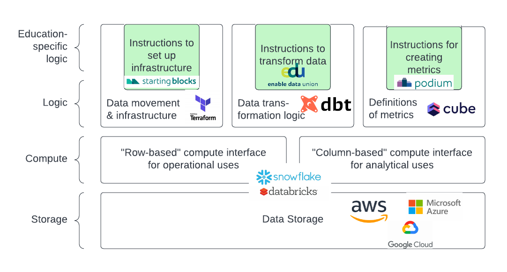

```{r setup, include=FALSE}
options(htmltools.dir.version = FALSE)
knitr::opts_chunk$set(
  fig.width=9, fig.height=3.5, fig.retina=3,
  out.width = "100%",
  cache = FALSE,
  echo = TRUE,
  message = FALSE, 
  warning = FALSE,
  hiline = TRUE
)
```

```{r xaringan-themer, include=FALSE, warning=FALSE}
library(xaringanthemer)
style_duo_accent(
  primary_color = "#007978",
  secondary_color = "#1C5CA7",
  inverse_header_color = "#CBDC3F"
)
```

## My current roles

--


* Lead Data Engineering team
--


* Product Owner for EDU / Stadium 
<center></center>

---

class: center middle

# Business Line Vision

---

## Defining Vision

--


* Communicate to the team(s) what actions to take
--


* Focus on the why 
--


* Problems and goals over specific ways to get there
--


* 3-5 years out 

---

## Ed-Fi Stack Business Line Vision

--


**Radically reduce the cost of delivering timely research-based analytics to decision makers in school systems.**
--


* Reduce aggregate spending
--


* Leverage advances in technology and open source tools 
--


* Don't fall in love with current tech
--


* Openness is our differentiator
--


**Make it close to free to use data with good methods**

---

## In 5 years if we are successful:
--


* Widespread adoption of Ed-Fi
--


* Widespread adoption of EDU
--


* Small agencies can get basic analytics and dashboards for low cost
--


* EA can build software products and research/analytics services with low data sourcing costs
--


* Researchers inside and outside of EA can access data with a consistent interface
--


* EA develops a 'clearinghouse' of metrics and analytics _definitions_

---
class: center middle

# Product Management Philosophy

---

## General principles
--

**Set up autonomous product teams and hold them accountable to outcomes**
--

* Provide direction on the most important problems to solve
--


* Learn quickly and if you're going to fail, fail fast
--


* Get tangible feedback from real users
--


* Don't try to please everyone at once

---

## Focus on users

--

**Focus everyone on product teams, including engineers, on the experience of users**
--


In platform products, users include researchers, analysts, software developers at EA
--


<center></center>

---
class: center middle

# The technical part

---

## What is a database?

A definition: 

_A system to store data on disks_

_-- plus --_ 

_a computer to save and retrieve the data_

<center></center>

---

## Row-oriented storage

<center></center>

---

## Column-oriented storage

<center></center>

---

## Why should you care?

--


** We currently spend a lot of resources moving data between different systems.**

--

Back to this definition of a database:

--

_A system to store data on disks_

_-- plus --_ 

_a computer to save and retrieve the data_

<br></br>

--


* The new class of databases separates compute from storage. 
--


* Storage cost is already negligible. 
--


* Tradeoff about to be solved

---

## Multiple interfaces to common or redundant storage

<center></center>

---

## Multiple interfaces to common or redundant storage

<center></center>

---

## Abstraction of logic

<center></center>

---

## Abstraction of logic

<center></center>

---

## Defining the logic

<center></center>

---

## Defining the logic

<center></center>

---

## What does this mean / who cares
--


* Old way: move & transform data. Future way: define how to access data. 
--


* Interfaces are virtual and depend on who/what is accessing
--


* Less dependence on "lower-level" tools like AWS or Snowflake
--


* Data coming in can be immediately used for analytics

---

## Implications

--


If an agency has Ed-Fi, "apply a lens" instead of "pull and transform data". -->
*Lower commitment, faster, more secure*
--


Publish definitions (metrics, models, business rules) separate from operating on data. -->
*Easier to share and scale good methods*
--


Use tools that abstract away from cloud providers. -->
*Move to the fastest or cheapest*
--
<center></center>
---
class: center middle

# Questions  

---

## Responsibility and accountability

--


* Responsibilities w/r/t impact lead and product development leads
--


* Home of future end user facing products built off this stack
--


* Evaluation of success of a platform business line

---
class: center, middle

# Thanks!

Slides created via the R packages:

[**xaringan**](https://github.com/yihui/xaringan)<br>
[gadenbuie/xaringanthemer](https://github.com/gadenbuie/xaringanthemer)

These rely on [remark.js](https://remarkjs.com), [**knitr**](http://yihui.name/knitr), and [R Markdown](https://rmarkdown.rstudio.com).
